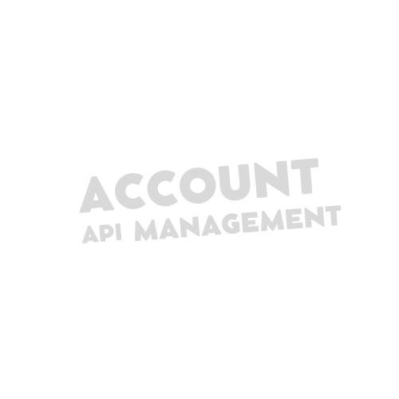

<p align="center">
  <a>
    
  </a>
</p>
<p align='center'>
    <a href="https://go.dev/">
        
    </a>
    <a href="https://gin-gonic.com/">
        
    </a>
    <a href="https://www.docker.com/">
        
    </a>
    <a href="https://www.postgresql.org/">
        
    </a>
</p>
<br />

## 💻 Project Description

Account Management API is a REST service centered around managing customer accounts and financial transactions. It provides a structured environment for recording various operation types—including purchases, installment purchases, withdrawals, and payments—ensuring data integrity by distinguishing between debt (negative) and credit (positive) transactions. The project employs Go for core logic, PostgreSQL for robust data persistence, and Docker for containerized deployment and environment consistency.

The project employs **Go** for core logic, **PostgreSQL** for robust data persistence, and **Docker** for containerized deployment and environment consistency.

## 📍 Motivation

* **Clean & Modular Design:** The project follows **Hexagonal Architecture (Ports and Adapters)**. This ensures that the core business logic is completely decoupled from external technologies, making the system highly testable and adaptable.
* **High-Performance API:** Built with **Go** and the **Gin framework**, the API is optimized for low latency and high throughput, essential for processing financial transactions in real-time.
* **Data Integrity:** A **Relational Database** was selected to guarantee **ACID compliance**, ensuring that every operation is recorded with total consistency.
* **Streamlined Environment:** The entire infrastructure is **Dockerized**, allowing for a "one-command" setup through **Docker Compose**.

## 🛠 API Endpoints

| Method | Endpoint | Description |
| :--- | :--- | :--- |
| `POST` | `/accounts` | Create a new customer account |
| `GET` | `/accounts/:id` | Retrieve account details and balance by ID |
| `POST` | `/transactions` | Create a new financial transaction |
| `GET` | `/transactions/:transactionId` | Retrieve specific transaction details by ID |
| `GET` | `/health` | Check API and Database connection status |

---

## 🚀 Getting Started

### Prerequisites
* Go 1.20+
* Docker & Docker Compose

### Installation & Run
```bash
# 1. Clone this repository
$git clone [https://github.com/evythrossell/account-management-api.git$](https://github.com/evythrossell/account-management-api.git$) cd account-management-api

# 2. Sync dependencies
$ go mod tidy

# 3. Spin up the infrastructure (Database + App)
$ docker compose up

# Stop services while keeping your data volumes intact and remove containers and their associated networks, defined in a docker-compose.yaml file
$ docker compose down

# Build Docker images defined in docker-compose
$ docker compose build

# Lists all Docker images available locally on your system
$ docker images

```

## 🦸 Author

[](https://www.linkedin.com/in/evelynthrossell/)